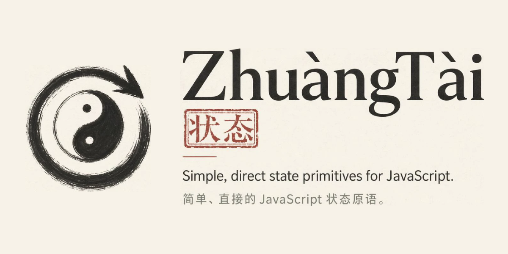

[](https://www.npmjs.com/package/@zhuangtai-js/core)
[](https://bundlephobia.com/package/@zhuangtai-js/core)
[](https://github.com/zhuangtai-js/ZhuangTai/actions/workflows/ci.yml)
[](./LICENSE)

# ZhuàngTài 状态

简单、直接的 JavaScript 状态原语。

ZhuàngTài 是一个轻量的 TypeScript 状态库，核心与框架无关，也不会隐藏调度行为。

## 包

- `@zhuangtai-js/core`：没有第三方运行时依赖的状态核心。
- `@zhuangtai-js/persist`：用于 `createAtom()` 创建的 atom 的持久化插件。
- `@zhuangtai-js/react`：面向 atom 和 computed 的 React 适配器，提供 hooks。

## Core API

```ts
import { atom, computed } from "@zhuangtai-js/core";

const count = atom(0);
const double = computed(() => count.get() * 2);

count.get();
count.set(1);
count.set((value) => value + 1);
count.watch((value, prevValue) => {});

double.get();
double.watch((value, prevValue) => {});
```

`@zhuangtai-js/core` 刻意保持零第三方运行时依赖。框架适配器会放在独立包中。

## 持久化

```ts
import { createAtom } from "@zhuangtai-js/core";
import { persist } from "@zhuangtai-js/persist";

const atom = createAtom().use(persist);

const theme = atom("light", {
  persist: {
    key: "theme",
  },
});

theme.set("dark");
```

`@zhuangtai-js/persist` 使用同步的 Web Storage 兼容存储。你可以显式传入 `storage` 选项；如果没有传入，它会在可用时回退到 `globalThis.localStorage`。自定义 `storage` 需要实现 `getItem`、`setItem` 和 `removeItem`。默认 JSON codec 支持 JSON 可序列化值；如果需要处理 `undefined`、函数或 symbol 等值，请使用自定义 codec。

## 许可证

ZhuàngTài 使用 [ISC 许可证](./LICENSE) 发布。你可以自由使用、复制、修改和分发，但需要在副本中保留版权声明和许可证声明。

---

# ZhuàngTài

Simple, direct state primitives for JavaScript.

ZhuàngTài is a tiny TypeScript state library with a framework-agnostic core and no hidden scheduling.

## Packages

- `@zhuangtai-js/core`: the zero-runtime-dependency state core.
- `@zhuangtai-js/persist`: persistence plugin for atoms created with `createAtom()`.
- `@zhuangtai-js/react`: React adapter with hooks for atoms and computeds.

## Core API

```ts
import { atom, computed } from "@zhuangtai-js/core";

const count = atom(0);
const double = computed(() => count.get() * 2);

count.get();
count.set(1);
count.set((value) => value + 1);
count.watch((value, prevValue) => {});

double.get();
double.watch((value, prevValue) => {});
```

`@zhuangtai-js/core` intentionally has no third-party runtime dependencies. Framework adapters live in separate packages.

## Persistence

```ts
import { createAtom } from "@zhuangtai-js/core";
import { persist } from "@zhuangtai-js/persist";

const atom = createAtom().use(persist);

const theme = atom("light", {
  persist: {
    key: "theme",
  },
});

theme.set("dark");
```

`@zhuangtai-js/persist` uses synchronous Web Storage-compatible storage. Pass a `storage` option explicitly, or it falls back to `globalThis.localStorage` when available. Custom `storage` objects need to implement `getItem`, `setItem`, and `removeItem`. Its default JSON codec supports JSON-serializable values; use a custom codec for values such as `undefined`, functions, or symbols.

## License

ZhuàngTài is released under the [ISC License](./LICENSE). You may use, copy, modify, and distribute it freely, provided that the copyright notice and license notice are retained in copies.
